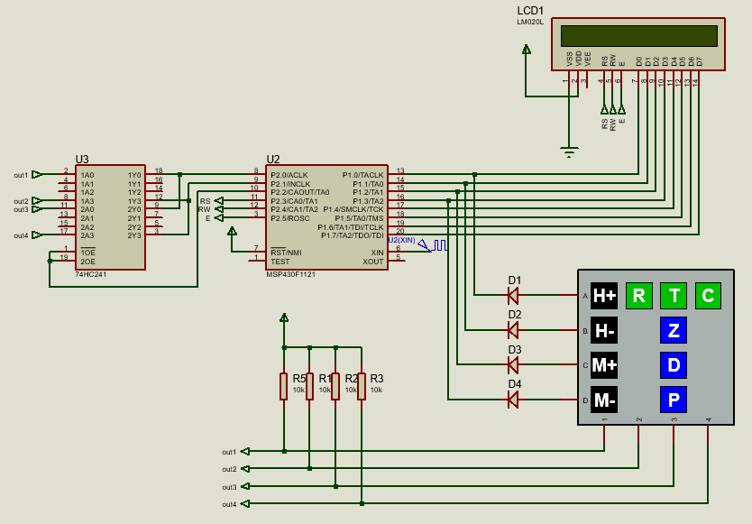
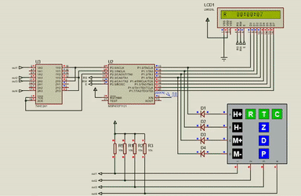
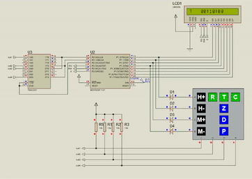
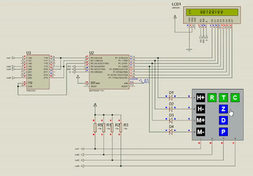

# Sistema de Temporização

Este projeto consiste em um sistema de temporização composto por três modos de operação: Relógio, Temporizador e Cronômetro. Esse sistema foi desenvolvido para o hardware MSP430F1121, que deve ser conectado em um display LCD de 16x1, responsável pela exibição, e um teclado matricial de 4x4, responsável pelo controle do sistema. O print da simulação a seguir apresenta o hardware e as conexões:

<h2>
    
</h2>
 
<h2>Funcionamento do Sistema</h2>

O sistema opera com base nas interrupções geradas pelo Timer A do MSP. Um cristal de 1MHz deve ser conectado ao CI, e o Timer deve ser configurado para gerar uma interrupção por segundo. Dentro da rotina de interrupção, devem ser feitas as atualizações necessárias no display.

Ao ser ligado, o sistema estará no modo Relógio, no horário 00:00:00. Os modos de funcionamento podem ser alternados usando as teclas R (Relógio), T (Temporizador) e C (Cronômetro). As teclas H+, H-, M+, M-, Z, D e P têm diferentes funções dependendo de qual modo o sistema está operando.

 

<h3>Modo Relógio</h3>

No modo Relógio, é incrementado um segundo no display a cada interrupção do Timer. As teclas H+ e H- podem ser usadas para ajustar as horas, enquanto M+ e M- ajustam os minutos. As teclas Z, D e P não possuem nenhuma função nesse modo. O valor do Relógio continua a ser atualizado mesmo com o sistema em outros modos.

<h4>
    
</h4>
 

<h3>Modo Temporizador</h3>

O modo Temporizador tem valor inicial 00:10:00 e inicia congelado. As teclas H+ e H- são usadas para configurar as horas da temporização, enquanto M+ e M- configuram os minutos da temporização. Após a tecla D ser pressionada, o sistema passa a decrementar um segundo no display a cada interrupção do Timer. A tecla P pode ser pressionada para congelar a temporização no tempo atual. A tecla Z pode ser pressionada para retornar o temporizador para o valor configurado anteriormente.

<h4>
    
</h4>
 

<h3>Modo Cronômetro</h3>

O modo Cronômetro inicia congelado. Após a tecla D ser pressionada, ele passa a incrementar um segundo no display a cada interrupção do Timer. A tecla P pode ser pressionada para congelar o cronômetro, enquanto a tecla Z pode ser pressionada para retornar o cronômetro para 00:00:00. As teclas H+, H-, M+ e M- não possuem nenhuma função nesse modo.

<h4>
    
</h4>